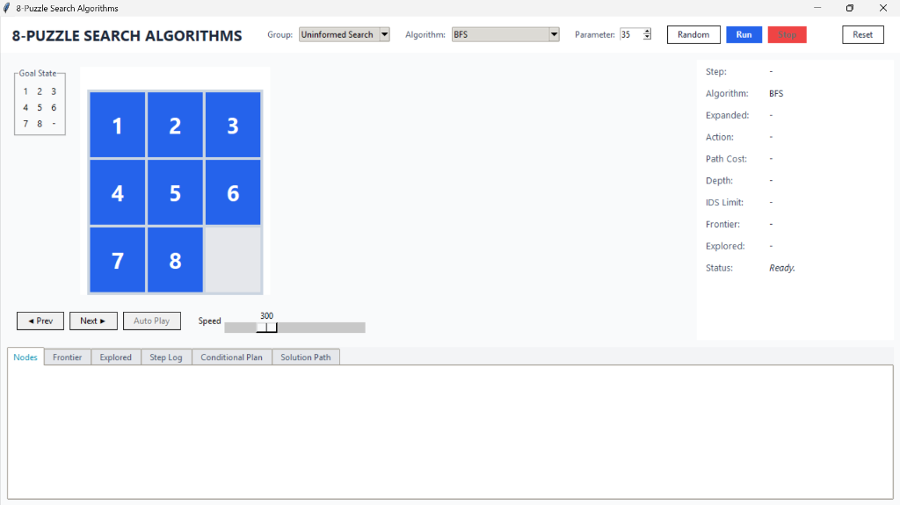

# 8-Puzzle Solver - Ứng Dụng Trí Tuệ Nhân Tạo Giải Bài Toán 8-Puzzle

## Giới thiệu

Đây là dự án ứng dụng Trí tuệ nhân tạo (Artificial Intelligence) để giải bài toán 8-Puzzle thông qua nhiều nhóm thuật toán tìm kiếm khác nhau. Mục tiêu của dự án là mô phỏng và so sánh hiệu quả của các kỹ thuật tìm kiếm thường được sử dụng trong AI trên cùng một bài toán kinh điển.

Dự án cung cấp giao diện trực quan cho phép người dùng:

- Sinh ngẫu nhiên trạng thái bàn cờ.
- Lựa chọn thuật toán cần thực thi.
- Quan sát quá trình tìm kiếm lời giải.
- Theo dõi đường đi từ trạng thái ban đầu đến trạng thái đích.
- So sánh hiệu năng giữa các thuật toán.
- Thống kê thời gian thực thi và số lượng trạng thái được mở rộng.

Đây là một dự án phù hợp cho môn Trí tuệ nhân tạo, Nhập môn AI, Kỹ thuật tìm kiếm và các học phần liên quan đến thuật toán.

---

## Mô tả bài toán 8-Puzzle

Bài toán 8-Puzzle bao gồm một bảng kích thước 3x3 chứa:

- 8 ô được đánh số từ 1 đến 8.
- 1 ô trống dùng để di chuyển các ô số.

Ví dụ trạng thái đích:

| 1 | 2 | 3 |
|---|---|---|
| 4 | 5 | 6 |
| 7 | 8 |   |

Tại mỗi bước, ô trống có thể di chuyển:

- Lên
- Xuống
- Sang trái
- Sang phải

Mục tiêu là tìm ra chuỗi hành động ngắn nhất hoặc phù hợp nhất để đưa trạng thái hiện tại về trạng thái đích.

---

## Mục tiêu của dự án

Dự án được xây dựng nhằm:

- Minh họa các kỹ thuật tìm kiếm trong AI.
- So sánh hiệu quả của nhiều thuật toán trên cùng một bài toán.
- Hỗ trợ học tập và nghiên cứu về Trí tuệ nhân tạo.
- Cung cấp môi trường trực quan để quan sát quá trình tìm kiếm lời giải.

---

## Các nhóm thuật toán được triển khai

### 1. Thuật toán tìm kiếm không có thông tin (Uninformed Search)

Các thuật toán trong nhóm này không sử dụng tri thức bổ sung về khoảng cách đến đích.

Bao gồm:

- Breadth First Search (BFS)
- Depth First Search (DFS)
- Iterative Deepening Search (IDS)

---

### 2. Thuật toán tìm kiếm có thông tin (Informed Search)

Các thuật toán sử dụng hàm heuristic để định hướng quá trình tìm kiếm.

Bao gồm:

- Uniform Cost Search (UCS)
- Greedy Best First Search (GBFS)
- A* Search

---

### 3. Thuật toán tìm kiếm cục bộ (Local Search)

Các thuật toán tập trung cải thiện trạng thái hiện tại thay vì duyệt toàn bộ không gian trạng thái.

Bao gồm:

- Simple Hill Climbing
- Steepest Ascent Hill Climbing
- Stochastic Hill Climbing
- Simulated Annealing
- Local Beam Search

---

### 4. Thuật toán tìm kiếm đối kháng (Adversarial Search)

Nhóm thuật toán thường được sử dụng trong các trò chơi có nhiều tác nhân.

Bao gồm:

- Minimax
- Alpha-Beta Pruning
- Expectimax

Các thuật toán này được điều chỉnh để hoạt động trên môi trường 8-Puzzle nhằm phục vụ mục đích học thuật và so sánh.

---

### 5. Bài toán thỏa mãn ràng buộc (Constraint Satisfaction Problem - CSP)

Các thuật toán CSP xem bài toán như một tập biến và tập ràng buộc cần thỏa mãn.

Bao gồm:

- Backtracking Search
- Forward Checking
- AC-3
- Min-Conflicts

---

### 6. Tìm kiếm phức hợp (Complex Search)

Nhóm thuật toán mở rộng nhằm xử lý môi trường không chắc chắn hoặc quan sát không đầy đủ.

Bao gồm:

- AND-OR Search
- Belief State Breadth First Search
- Partial Observation Search

---

## Cấu trúc thư mục dự án

```text
8_puzzle
│
├── algorithms
│   ├── uninformed
│   │   ├── bfs.py
│   │   ├── dfs.py
│   │   └── ids.py
│   │
│   ├── informed
│   │   ├── ucs.py
│   │   ├── gbfs.py
│   │   └── astar.py
│   │
│   ├── local_search
│   │   ├── simple_hill_climbing.py
│   │   ├── steepest_ascent_hill_climbing.py
│   │   ├── stochastic_hill_climbing.py
│   │   ├── simulated_annealing.py
│   │   └── local_beam.py
│   │
│   ├── adversarial
│   │   ├── minimax.py
│   │   ├── alpha_beta.py
│   │   └── expectimax.py
│   │
│   ├── csp
│   │   ├── backtracking.py
│   │   ├── forward_checking.py
│   │   ├── ac3.py
│   │   └── min_conflicts.py
│   │
│   └── complex
│       ├── and_or_search.py
│       ├── belief_state_bfs.py
│       └── partial_observation.py
│
├── ui
│   ├── map_canvas.py
│   ├── stats_panel.py
│   └── details_notebook.py
│
├── map_generator.py
├── main.py
└── README.md
```

---

## Chức năng chính

### Sinh bản đồ ngẫu nhiên

Người dùng có thể tạo các trạng thái 8-Puzzle khác nhau để kiểm tra khả năng giải quyết của từng thuật toán.

### Lựa chọn thuật toán

Hệ thống cho phép lựa chọn trực tiếp thuật toán cần thực thi thông qua giao diện.

### Hiển thị lời giải

Sau khi tìm kiếm thành công, chương trình hiển thị:

- Đường đi lời giải.
- Các bước di chuyển.
- Trạng thái trung gian.
- Trạng thái đích.

### Thống kê hiệu năng

Đối với mỗi lần thực thi, hệ thống ghi nhận:

- Thời gian chạy.
- Chi phí lời giải.
- Độ sâu lời giải.
- Số lượng trạng thái mở rộng.
- Số lượng trạng thái sinh ra.

Nhờ đó người dùng có thể đánh giá và so sánh hiệu quả giữa các thuật toán.

---

## Công nghệ sử dụng

Ngôn ngữ lập trình:

- Python

Các lĩnh vực áp dụng:

- Artificial Intelligence
- Search Algorithms
- Constraint Satisfaction Problem
- Heuristic Search
- Adversarial Search
- Local Search

---

## Hướng dẫn cài đặt

### Bước 1: Clone repository

```bash
git clone https://github.com/your-username/8-puzzle-solver.git
```

### Bước 2: Di chuyển vào thư mục dự án

```bash
cd 8-puzzle-solver
```

### Bước 3: Cài đặt thư viện cần thiết

```bash
pip install -r requirements.txt
```

Nếu dự án không cung cấp file requirements.txt, hãy cài đặt các thư viện được sử dụng trong mã nguồn.

### Bước 4: Chạy chương trình

```bash
python main.py
```

---

## Kết quả đạt được

Dự án triển khai nhiều nhóm thuật toán tìm kiếm khác nhau trên cùng một bài toán, giúp:

- Hiểu rõ nguyên lý hoạt động của từng thuật toán.
- Quan sát sự khác biệt về hiệu năng.
- Đánh giá ưu và nhược điểm của từng phương pháp.
- Hỗ trợ học tập trong lĩnh vực Trí tuệ nhân tạo.

---

